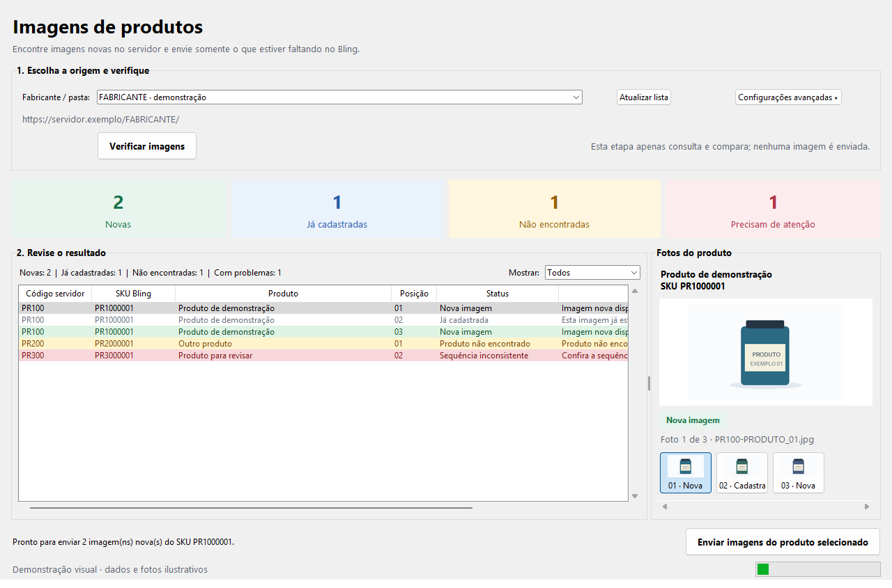

# Integração de Imagens com o Bling

Automação com supervisão humana para localizar imagens em um servidor HTTP,
associá-las aos SKUs de produtos e cadastrar os links que faltam no Bling.
Você escolhe a pasta, revisa a comparação e confirma o envio de um produto
por vez. Disponível por interface gráfica no Windows e por linha de comando.



## Funcionalidades

- Seleção de fabricantes e navegação por vários níveis de subpastas.
- Busca na própria pasta selecionada, mesmo quando ela também contém subpastas.
- Leitura de imagens `.jpg`, `.jpeg`, `.png` e `.webp` em índices HTML.
- Agrupamento por código e ordenação pelos sufixos `_01`, `_02`, `_03` etc.
- Identificação de posições repetidas e lacunas na sequência de imagens.
- Comparação com produtos ativos do Bling e identificação de imagens existentes.
- Simulação e relatórios CSV para conferir o resultado antes do envio.
- Cards coloridos por status e prévia das fotos do produto com miniaturas clicáveis.
- Envio das imagens novas de um SKU, preservando os links existentes e
  consultando o produto novamente para conferir a atualização.
- Autorização OAuth local e renovação automática do token na GUI.

## Requisitos

Para usar o pacote `auto-fotos-windows.zip`, basta Windows 64 bits: Python,
Tkinter e as bibliotecas já estão incluídos no `AutoFotos.exe`. Extraia o ZIP,
edite o `.env` ao lado do executável e siga o `LEIA-ME.txt` para autorizar o Bling.
O `.env` reúne as configurações; não é necessário um `.config` separado.
Os relatórios são salvos por padrão na pasta do executável. Ao atualizar,
substitua somente o `.exe` e preserve seu `.env`.

Os requisitos abaixo se aplicam à execução pelo código-fonte:

- Python 3.10 ou superior, com Tkinter para a interface gráfica.
- Windows para a GUI e o inicializador `abrir_gui.cmd`.
- Servidor HTTP/HTTPS com listagem de diretórios por links HTML.
- Aplicativo cadastrado no Bling com acesso à consulta de produtos e, para
  enviar imagens, ao escopo `Salvar imagens dos Produtos`.

## Instalação

Na pasta do projeto, execute no PowerShell:

```powershell
py -m venv .venv
.\.venv\Scripts\python.exe -m pip install -r requirements.txt
Copy-Item .env.example .env
```

Copie o exemplo somente na primeira instalação para preservar uma configuração
local existente. Edite `.env` e informe:

| Variável | Uso |
| --- | --- |
| `IMAGENS_BASE_URL` | URL real da pasta inicial do fabricante, terminando em `/`. |
| `SERVIDOR_VERIFY_SSL` | `true` para validar o certificado do servidor de imagens. |
| `BLING_CLIENT_ID` | Identificador do aplicativo Bling. |
| `BLING_CLIENT_SECRET` | Segredo do aplicativo Bling. |
| `BLING_REDIRECT_URI` | Callback local; padrão `http://127.0.0.1:8765/callback`. |

A URL `https://servidor.exemplo/FABRICANTE/` é fictícia e deve ser substituída.
Tokens e a data de expiração são gravados no `.env` pelo fluxo OAuth.
`BLING_API_BASE_URL` e `BLING_ENABLE_JWT` já possuem os valores usados pela integração.

Se o servidor de imagens tiver certificado inválido, é possível configurar
`SERVIDOR_VERIFY_SSL=false` para esse servidor. A conexão com a API do Bling
continua validando o certificado normalmente.

## Autorizar o Bling

No cadastro do aplicativo Bling, configure o redirecionamento:

```text
http://127.0.0.1:8765/callback
```

Depois de preencher as credenciais no `.env`, execute:

```powershell
.\.venv\Scripts\python.exe oauth_bling.py autorizar
```

O navegador abre para aprovação do acesso. Ao concluir, os tokens são salvos
localmente. Também é possível autorizar pela GUI em `Configurações avançadas`.
Se alterar os escopos ou revogar os tokens, autorize novamente.

Para renovar manualmente:

```powershell
.\.venv\Scripts\python.exe oauth_bling.py renovar
```

Na abertura da GUI, o programa verifica o acesso e tenta renovar a autorização
quando o token está vencido ou a menos de cinco minutos do vencimento.

## Usar a interface gráfica

Abra `abrir_gui.cmd` com duplo clique ou execute:

```powershell
.\.venv\Scripts\python.exe gui.py
```

1. Escolha o fabricante na lista de pastas do servidor.
2. Se houver subpastas, escolha uma no novo seletor. Outros seletores aparecem
   conforme os níveis encontrados, por exemplo: Viapol → linha → produtos.
3. Para consultar imagens na raiz de um nível, mantenha a opção
   `Buscar nesta pasta (raiz deste nível)`. A URL exibida indica a pasta usada.
4. Clique em `Verificar imagens` e revise a tabela e os contadores.
5. Selecione uma linha com status `Nova imagem` e clique em
   `Enviar imagens do produto selecionado`.
6. Confira o produto e digite `APLICAR` para confirmar o envio.

A verificação consulta a pasta escolhida; ela não percorre automaticamente toda
a árvore. Trocar de pasta remove as seleções dos níveis abaixo e invalida a
comparação anterior. As consultas são executadas em segundo plano.

O envio abrange todas as imagens novas do SKU selecionado. Imagens já existentes,
produtos não encontrados e linhas com problemas não habilitam o botão de envio.
Filtros ajudam a revisar esses resultados. Pasta dos relatórios, validação TLS
e controles de autorização ficam em `Configurações avançadas`.

Ao selecionar uma linha, o painel à direita mostra as fotos da origem para aquele
produto, com etiquetas de status. Clique nas miniaturas para conferir cada foto;
a seleção do produto para envio continua sendo feita pela tabela. Arraste a
divisória entre a tabela e o painel para ajustar o espaço. As fotos carregam em
segundo plano e uma falha na prévia não impede a conferência ou o envio.

Se já tinha o programa instalado, atualize as dependências para habilitar a prévia:

```powershell
.\.venv\Scripts\python.exe -m pip install -r requirements.txt
```

## Usar a linha de comando

Coletar imagens da pasta configurada no `.env`:

```powershell
.\.venv\Scripts\python.exe main.py
```

Escolher outra pasta, inclusive uma subpasta:

```powershell
.\.venv\Scripts\python.exe main.py --url "https://servidor.exemplo/FABRICANTE/SUBPASTA/"
```

Consultar os produtos ativos no Bling ou simular a inclusão de imagens:

```powershell
.\.venv\Scripts\python.exe main.py --consultar-bling
.\.venv\Scripts\python.exe main.py --simular-imagens
```

Enviar imagens novas para um único SKU após revisar a simulação:

```powershell
.\.venv\Scripts\python.exe main.py --aplicar-imagens `
  --sku-piloto PR82540001 `
  --confirmar-escrita APLICAR
```

A escrita exige as três opções acima. Sem imagens novas, nenhum `PATCH` é enviado.
Consulte todas as opções com `main.py --help`.

## Regras de associação e limites

Os arquivos devem começar com `PR`, `RE` ou `MLB` seguido de números e terminar com
uma posição, por exemplo `PR8254-PRODUTO_01.jpg`. O código `PR8254` corresponde
ao SKU `PR82540001`, acrescentando o sufixo `0001`.

Os códigos `MLB` já representam o SKU completo e não recebem sufixo:
`MLB5031544400-PRODUTO_01.jpg` corresponde ao SKU `MLB5031544400`.

A exceção `PR31597` → `RE315970001` está em `SUBSTITUICOES_CODIGO_BLING`,
no arquivo `servidor.py`. Essas regras refletem o catálogo de origem e devem
ser revisadas ao adaptar o projeto para outra operação.

A integração considera somente produtos ativos. Produtos ausentes são
sinalizados e ignorados. Sequências inconsistentes, divergências de SKU,
duplicidade de produtos ativos e erros de consulta bloqueiam o envio.
O projeto não cria nem exclui produtos.

## Relatórios

| Arquivo padrão | Conteúdo |
| --- | --- |
| `imagens_produtos.csv` | Imagens encontradas e sequência por produto. |
| `conferencia_bling.csv` | Correspondência com produtos do Bling. |
| `plano_imagens.csv` | Imagens novas, existentes, ignoradas e bloqueadas. |
| `aplicacao_imagens.csv` | Resultado do envio e conferência posterior. |

Os CSVs usam UTF-8 com BOM para facilitar a abertura no Excel. A GUI permite
escolher a pasta de saída; a CLI permite definir os nomes pelos argumentos
`--saida`, `--saida-bling`, `--saida-simulacao` e `--saida-aplicacao`.
Feche relatórios abertos no Excel antes de gerá-los novamente.

## Estrutura

```text
auto-fotos/
├── .github/workflows/tests.yml  # testes no GitHub Actions
├── tests/                      # testes locais com dados simulados
├── .env.example                # configuração pública sem credenciais
├── .gitattributes              # normalização de arquivos de texto
├── .gitignore                  # exclusão de segredos e saídas locais
├── abrir_gui.cmd               # inicializador para Windows
├── bling.py                    # consulta e atualização de imagens
├── gui.py                      # interface Tkinter
├── main.py                     # CLI, simulação e relatórios
├── oauth_bling.py              # autorização e renovação OAuth
├── previa.py                   # download e redução de fotos para a GUI
├── requirements.txt            # dependências Python
└── servidor.py                 # leitura e classificação das imagens
```

## Testes

```powershell
.\.venv\Scripts\python.exe -m unittest discover -s tests -v
```

Os testes usam dados simulados e não acessam o servidor nem a conta do Bling.
Os testes de interface precisam de Tkinter e de uma sessão gráfica.
O workflow do GitHub Actions executa a suíte no Windows com Python 3.10 e 3.14.

## Gerar o executável Windows

Em um ambiente Python no Windows, instale as dependências de compilação e execute:

```powershell
.\.venv\Scripts\python.exe -m pip install -r requirements-build.txt
.\.venv\Scripts\python.exe gerar_executavel.py
```

O resultado fica em `dist/auto-fotos-windows.zip`, contendo `AutoFotos.exe`,
`.env` com valores de exemplo e `LEIA-ME.txt`. A compilação incorpora somente
as dependências do programa; as credenciais locais e os relatórios não entram
no ZIP. Para gerar a versão de 64 bits, use Python de 64 bits.

O executável oferece um diagnóstico local sem acessar o Bling ou o servidor:

```powershell
.\dist\windows\AutoFotos.exe --diagnostico "$PWD\dist\diagnostico.json"
```

O JSON verifica a criação da interface, prévia de imagens, certificados TLS
e localização do `.env` e dos relatórios. Ele não contém credenciais.

## Publicar no GitHub

O `.gitignore` exclui `.env` e suas variantes locais, ambientes virtuais,
caches, logs, relatórios CSV e a cópia local aninhada em `auto-fotos/`.
O `.env.example` deve permanecer versionado com as credenciais vazias.

Antes de fazer o commit, revise o que será publicado:

```powershell
git status --short
git add .
git diff --cached --stat
git diff --cached
git commit -m "Prepara Auto Fotos para publicacao"
```

Crie um repositório vazio no GitHub. Se ainda não houver um remoto `origin`,
adicione-o substituindo `SEU_USUARIO` pelo seu usuário ou organização:

```powershell
git remote add origin https://github.com/SEU_USUARIO/auto-fotos.git
git branch -M main
git push -u origin main
```

Se `origin` já existir, confira o destino com `git remote -v` antes do envio.
O `.gitignore` não remove arquivos de commits anteriores. Se houver dados
internos no histórico, revise esse histórico antes de publicar um repositório
público. Credenciais que tenham sido publicadas precisam ser revogadas.
